# 반응형 웹 디자인

## 1. 반응형 웹 디자인이란?

- 반응형 웹 디자인이라는 용어는 2010년 **이단 마르코트**에 의해 이야기되기 시작했습니다.
- 다양한 디바이스에 따라 화면의 크기가 최적화되도록 자동으로 조절되는 웹페이지를 의미합니다.
  - 하나의 웹페이지 소스(HTML), 하나의 주소(URL), 하나의 컨텐츠로 최적화된 웹페이지를 제공하는 것을 목적으로 합니다.


### 1.1 탄생 배경

초창기에 웹 페이지를 구축할 때는 매우 구체적인 화면 크기를 공략 대상으로 삼았습니다. 그래서 예상한 크기에서 벗어난 화면의 기기를 가지고 있다면 원하지 않는 스크롤 막대에서부터 지나치게 긴 길이의 라인, 사용 공간이 부족하게 되는 결과를 낳았습니다. 이와 같은 문제를 해결하기 위해 반응형 웹 디자인 개념이 등장했습니다.

### 1.2 핵심 원리

#### 1.2.1 유연한 그리드 (Fluid Grid)

- 유연한 그리드는 사용자 기기의 화면 크기에 따라 최적화(변경) 됩니다.
- 픽셀(`px`)이 아닌, 퍼센트(`%`) 또는 `em`, 'rem' 같은 상대 측정 단위가 사용됩니다.


#### 1.2.2 유연한 이미지 (Flexible Images)

- 이미지의 크기가 다양한 디바이스의 화면 크기에 따라 자동으로 확대/축소되는 것을 말합니다.
  - 일반적으로 브라우저상의 이미지는 고정된 크기를 가집니다,
  - 반양형 웹 디자인에서는 이미지가 브라우저의 창 크기에 맞게 적절한 형태로 변경될 수 있도록, 창의 가로너비에 유동적으로 변하는 단위를 사용합니다,.
  - 기술적으로는 아래와 같은 CSS 코드를 추가해주면 가변성을 갖게 됩니다.
  ```css
  max-width: 100%;
  ```


#### 1.2.3 미디어 쿼리 (Media Query)

- CSS2부터 시작되어 CSS3에서 본격적으로 쓰이기 시작한 웹 기법입니다.
- CSS3 Media Queries를 사용하면 반응형 디자인을 보다 구체적으로 세분화하고 특정 화면 크기에 따라 적절하게 조정할 수 있습니다.
- 미디어 쿼리를 사용하면 화면 크기를 결정하고 CSS 스타일을 반영합니다.
- 미디어 쿼리의 코드는 아래와 같습니다.

```css
@media 미디어 타입 (너비 및 높이) {
    (CSS 입력)
}
```


<hr />

### 1.3 장점

#### 1.3.1 간편한 유지보수

- 모바일 버전과 데스크톱 버전같이 두 개의 웹사이트를 만들 경우
  - 새로운 내용이 추가되거나 수정이 필요할 때 개별적으로 추가 및 수정이 필요합니다.
  - 개별 작업을 해야하므로 공수가 많이 들어갑니다.
- 반응형 웹으로 작업할 경우 사용자 디바이스와 상관없이 모든 디자인을 하나의 HTML 파일과 CSS 파일에서 작업하기 때문에 유지보수가 훤씬 쉽고 간편합니다.

#### 1.3.2 유연한 마케팅

- 쉽게 접근할 수 있는 점과 다양한 활동을 자유롭게 펼칠 수 있기 때문에 마케팅 활동의 주요 수단으로 사용됩니다.
  - 데스크톱 버전만 만들게되면 작은 화면의 스마트 기기선 정보들이 제대로 전달되지 않을 수 있습니다.
- 반응형 기술을 이용하여 웹사이트를 개발하면 다양한 기기에 따라 최적화된 구조로 웹사이트를 보여줄 수 있습니다.
  - 언제, 어디서, 어떻게든 접근이 용이하기 때문에 마케팅이 유리합니다.

#### 1.3.3 최적화된 검색 엔진

- 모바일 버전과 데스크탑 버전 두 개의 사이트를 가지고 있는 경우, 검색엔진에서는 어떠한 주소의 정보가 정확한 정보인지 확인하기 힘들어 검색 결과에서 제외하거나 검색 결과 상위권에 배치하는 것이 상대적으로 불리해집니다.
  - 상위권에 노출시키고자 광고를 하게된다면 광고 비용 또한 두개의 웹사이트이기 때문에 두 배로 들것입니다.
- **반응형 웹페이지의 경우**, 하나의 주소로 검색 결과에 좀 더 노출이 잘될 수 있습니다.

#### 1.3.4 미래 지향적 기술

- 휘어지는 화면을 탑재한 스마트 기기, TV, 냉장고 등 상상만 했던 기기들이 출시되고 있고 앞으로 어떤 크기의 기기가 나올지 모르는 사황에서 반응형 웹은 미래 지향적이고, 미래를 준비하는 바람직한 대안이라고 할 수 있습니다.

<hr />

### 1.4 단점

#### 1.4.1 길어진 페이지 로딩 시간

- 반응형 페이지를 잘못 제작하게 되면 PC에 있는 1200px 사이즈의 이미지를 사용할 때 그 이미지 그대로 모바일에서 사용이 된다.

<hr />

### 1.5 반응형 웹 디자인 패턴

#### 1.5.1 유동형 (Mostly Fluid)

- 가변형 그리드로 구성하여 단순히 컨텐츠의 폭을 맞추는 방법입니다.
  - 큰 화면에서 중간 크기의 화면까지는 여백 정도만 조정됩니다.
  - 중간 크기에서 작은 화면이 되면 그리드가 움직이면서 컨텐츠를 수직으로 재배치합니다.
- 해당 패턴을 사용하는 사이트는 다음과 같습니다.
  - [A List Apart](https://mediaqueri.es/ala/)


#### 1.5.2 열 끌어놓기 (Column Drop)

- 화면폭이 좁아져서 더이상 컨텐츠의 정상적인 표시가 힘들 경우에 컨텐츠 영역의 확보를 위해 컬럼을 하단으로 떨궈서 열을 수직으로 쌓습니다.
- 화면 크기에 관계없이 사용하는 페이지를 작성하는데 도움이 됩니다.
- 해당 패턴을 사용하는 사이트는 다음과 같습니다.
  - [Modernizr](https://modernizr.com/)


#### 1.5.3 배치 이동 (Layout Shifter)

- 반응성이 가장 뛰어난 패턴입니다.
- 스크린이 크기마다 다른 형태의 레이아웃을 사용합니다.
- 컬럼을 이동 및 재배치하는 방식이 아닌, 기기나 화면 사이즈에 따라 콘텐츠를 이동시켜 레이아웃을 변형합니다.
- 다른 패턴에 비해 단조로움을 벗어날 수 있습니다.
  - 단, 서버의 작업이 상대적으로 많이 필요하고 유지보수가 복잡합니다.
- 해당 패턴을 사용하는 사이트는 다음과 같습니다.
  - [Example of Layout Shifter](https://fjcalzado.github.io/DemoSeries-Responsive-Layout-Patterns/pages/layout-shifter.html)


#### 1.5.4 미세 조정 (Tiny Tweaks)

- 글꼴이나 이미지의 크기 조정 또는 콘텐츠 미세 이동 등과 같은 작은 변화만 이루어집니다.
- 보통 하나의 컬럼을 사용하며 브라우저의 폭이 변하더라도 레이아웃이 크게 변하지 않습니다.
  - 보통 블로그에서 많이 사용됩니다.
- 해당 패턴을 사용하는 사이트는 다음과 같습니다.
  - [Ginger Whale](http://gingerwhale.com/)


#### 1.5.5 오프 캔버스 (off-Canvas)

- 메뉴나 서브 컬럼을 화면 좌/우측에 숨셔두고 필요할때 노출하는 패턴입니다.
  - 콘텐츠를 수직으로 쌓지 않고 사용 빈도가 낮은 콘텐츠를 화면 밖에 배치합니다.
  - 화면 크기가 커지면 표시하고, 작은 화면에서는 클릭했을 경우에만 보여줍니다.
- 해당 패턴을 사용하는 사이트는 다음과 같습니다.
  - [HTML5Rocks 문서](https://www.html5rocks.com/ko/tutorials/developertools/async-call-stack/)


<hr />

### 1.6 반응형 웹과 적응형 웹의 차이

- 반응형 웹은 하나의 템플릿을 사용해 모든 기기에 대응합니다.
- 적응형 웹은 선별된 기기 유형에 따라 별도의 독립적인 템플릿이 요구됩니다.
  - NAVER, DAUM 같은 포털 사이트의 경우 모바일 환경에 대응하기 위해 별도의 URL을 서비스합니다.
- 반응형 웹과 적응형 웹의 비교

| &nbsp;                | 반응형 웹                                                  | 적응형 웹                          |
| --------------------- | :--------------------------------------------------------- | :--------------------------------- |
| 기기 감지             | 서버 또는 브라우저에서 기기 감지                           | 미디어쿼리로 기기 감지             |
| 콘텐츠 최적화         | 필요 콘텐츠만 다운로드                                     | 모든 콘텐츠 다운로드               |
| 기기 특성별 처리 방법 | 기기 마다 다른 템플릿                                      | 하나의 템플릿                      |
| 로드 속도             | 빠름 (필요한 리소스만 다운)                                | 느림 (모든 리소스 다운)            |
| 개발/배포             | 기존 사이트 변경없이 개발 가능<br /> 그러나 추가 비용 발생 | 기존 사이트를 전면 리뉴얼하여 개발 |

## 2. 반응형 웹디자인의 구성요소와 속성

반응형 웹디자인은 전통적인 웹디자인과 다르게 다양한 디바이스의 픽셀밀도와 표시가능 영역(Viewport)에 반응하여 적절한 구성요소와 레이아웃을 표시해 줄 수 있어야 합니다.

HTML을 설계할 때 반응형 웹사이트를 만들기 위해서는 디바이스 해상도와 뷰포트 해상도를 고려하여 다양한 디바이스에 맞는 구성요소들을 준비할 수 있습니다.

### 2.1 뷰포트

#### 2.1.1 뷰포트에 대한 이해

먼저 뷰포트의 개념에 대하여 이해해야 합니다. 뷰포트는 기기별로 표시할 수 있는 영역을 말하는 용어이지만 이는 전통적인 픽셀단위가 아니며, 픽셀밀도를 고려해 표현해야 했기 때문에 픽셀밀도를 뷰포트의 개념에 추가하였습니다.

브라우저에서 전통적으로 픽셀과 뷰포트는 1:1의 크기로 계산되어 100px은 디스플레이에서 100px을 뜻하고 있었습니다. 하지만 점점 디바이스의 디스플레이가 가진 픽셀밀도(PPI)가 높아지게 되면서 1:1 매칭을 통한 뷰포트 계산은 실제로 화면에 너무 작게 표시되는 문제가 발생했습니다. 이를 해결하기 위해 OS단에서는 HiDPI와 같이 픽셀밀도를 계산하여 디스플레이에 표시해주는 기능들이 생겨나기 시작했습니다. 웹에서도 이에 대응하여 뷰포트를 통해 디바이스의 픽셀밀도를 계산하여 화면에 출력해 줄 수 있습니다.

> 픽셀 밀도를 표현하는 방법은 DPR이 있습니다. DPR은 Device Pixel Ratio의 약자로 디바이스에서 인식하는 1픽셀과 실제 디스플레이에서 표현할 때의 비율을 나타내는 방법으로 만약 DPR이 2.0이라면, 디바이스의 1픽셀이 디스플레이에서는 4(2x2)픽셀로 표시되고 있음을 나타냅니다. 우리는 편의상 이를 배율이라 부르겠습니다.<br> > 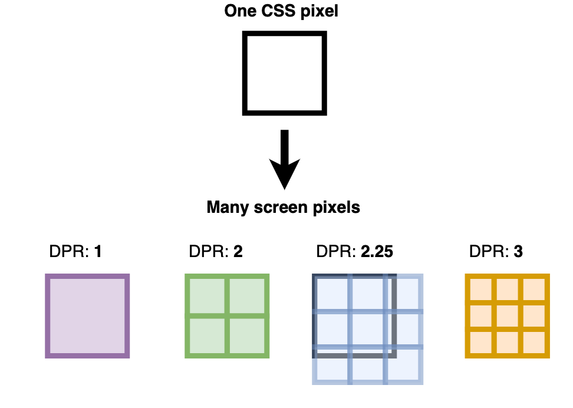

#### 2.1.2 뷰포트 메타태그

> viewport 메타태그는 아직 표준이 아니만 대부분의 모바일 브라우저에서 원활한 뷰포트 지정을 위해 선언해야 합니다.

기기별로 다른 픽셀밀도를 브라우저에서 인식할 수 있도록 HTML의 meta태그에 다음과 같이 뷰포트를 지정하는 속성을 추가해야 합니다. 가장 많이 사용하는 meta태그의 속성을 사용하면 아래와 같습니다.

```html
<meta name="viewport" content="width=device-width, initial-scale=1.0" />
```

위 내용은 뷰포트의 가로 크기를 기기의 가로 크기와 일치시키고(width=device-width), 기기와 뷰포트의 배율 계산을 1:1로 진행하겠다는(initial-scale=1.0) 의미를 갖고 있습니다. 더 다양한 속성을 아래와 같이 제공됩니다.

| 속성          | 설명                                                                         | 값                    |
| ------------- | ---------------------------------------------------------------------------- | --------------------- |
| width         | 뷰포트의 넓이 설정                                                           | 넓이 값, device-width |
| height        | 뷰포트의 높이 설정                                                           | 높이 값               |
| initial-scale | 최초 배수를 표시                                                             | 배수 값               |
| minimum-scale | 최대 축소 배수를 표시                                                        | 배수 값               |
| maximum-scale | 최대 확대 배수를 표시                                                        | 배수 값               |
| user-scalable | 사용자의 단말 확대기능을 허용하는지 여부 표시                                | yes, no               |
| shrink-to-fit | 애플 디바이스 관련 속성으로 브라우저 UI를 제외하여 높이를 계산할지 정합니다. | yes, no               |

> 이 외에도 비표준 속성이 몇가지 더 존재합니다.

```html
<!DOCTYPE html>
<html lang="en">
  <head>
    <meta charset="UTF-8" />
    <meta http-equiv="X-UA-Compatible" content="IE=edge" />
    <meta name="viewport" content="width=device-width, initial-scale=1.0" />
    <title>Document</title>
    <style>
      .box {
        width: 100px;
        height: 100px;
        background-color: tomato;
      }
    </style>
  </head>
  <body>
    <div class="box"></div>
  </body>
</html>
```

위와 같은 코드를 아이폰X에서 시뮬레이팅 하면 다음과 같이 나옵니다.

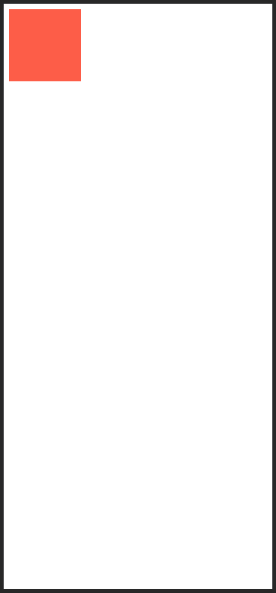

아이폰 X의 디스플레이 해상도는 1125 x 2436 지만 디바이스 해상도는 375 x 812 으로 3배율을 갖고 있다는 것을 알 수 있습니다.
즉 실제로 디스플레이에 그려진 100px의 박스는 실제 기기 디스플레이에서는 300px으로 표현되고 있습니다.
여기서 메타태그의 값을 다음과 같이 변경하면 실제 출력 크기를 맞출 수 있습니다.

```html
<meta name="viewport" content="width=device-width, initial-scale=0.333" />
```

3:1의 픽셀밀도를 1:1로 변경하였습니다. 이렇게 하면 실제로 디스플레이 상에서 100px의 박스가 표시됩니다. 이는 실제로 viewport 메타태그를 제거했을 때와 같은 결과입니다.

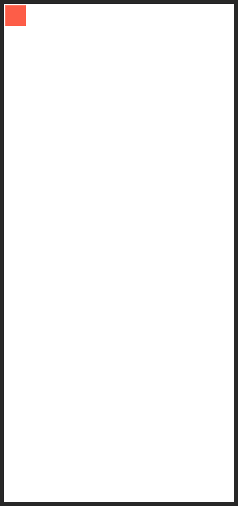

또한 다음과 같이 뷰포트 사이즈를 직접 지정할 수 있습니다. 뷰포트를 100px으로 지정하면 100px박스가 화면에 가득 차게 나타날 것입니다. 가로 사이즈를 직접 지정할 때에는 디바이스와 픽셀밀도를 계산할 필요가 없기 때문에 initial-scale 속성을 제거해야 정상적으로 출력됩니다.

```html
<meta name="viewport" content="width=100" />
```

다음과 같이 100px의 뷰포트에 100px의 박스가 꽉차게 출력됩니다.

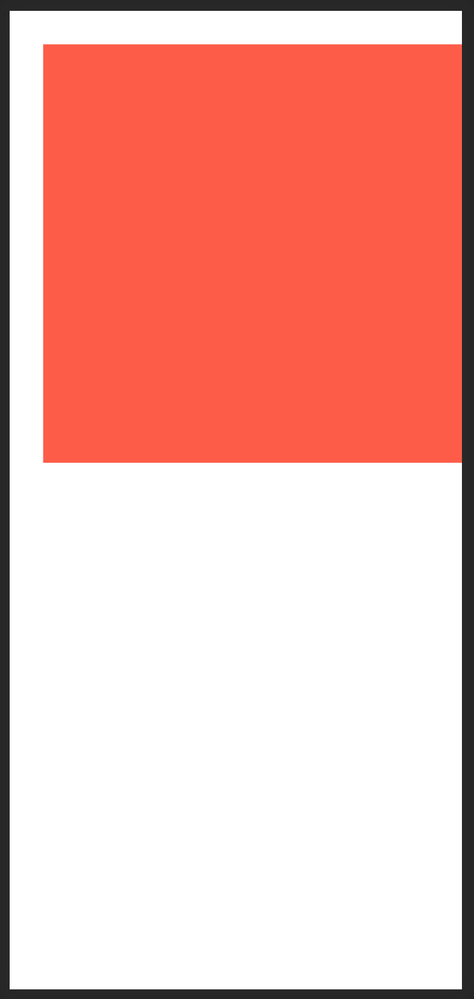

모바일 디바이스에서는 핀치 줌 / 아웃을 통해 표시되는 영역을 확대하거나 축소할 수 있습니다. 하지만 이를 제한하거나 방지해서 사용자가 컨텐츠에 원치 않는 방법으로 접근하는 것을 방지할 수 있습니다. 다음과 같은 설정을 통해 최대 확대 배율과 최대 축소 배율등을 정할 수 있습니다.

```html
<meta name="viewport" content="width=device-width, initial-scale=1.0, minimum-scale=0.5, maximum-scale=2.0" />
```

메타태그를 위와 같이 수정해서 핀치줌 / 아웃을 통해 최대 2배로 확대할 수 있고 최대 1/2배로 축소할 수 있도록 지정하였습니다. 만약 핀치줌 / 아웃을 완전히 방지하려면 다음과 같이 설정할 수 있습니다.

```html
<meta name="viewport" content="width=device-width, initial-scale=1, user-scalable=no" />
```

---

위의 예제들에서 등장한 박스의 사이즈는 모두 100x100으로 동일했지만 뷰포트의 변화를 통해 계속해서 보이는 사이즈가 바뀌는 것을 알 수 있었습니다. 이를 통해 다양한 디바이스에서 화면을 렌더링 할 때 픽셀밀도를 어떻게 지정하여 표현하는지 알아보았습니다.

반응형 웹사이트를 구현하기 위해서는 디바이스마다 다른 픽셀 밀도와 뷰포트 사이즈를 고려해 알맞은 해상도의 이미지를 보여주는 기능을 사용할 수 있습니다. 크게 두 가지 방법이 있으며 ``태그의 `srcset`, `sizes` 속성을 이용하는 방법, 그리고 `<picture>`태그와 `<source>`태그를 이용하는 방법이 있습니다.

---

### 2.2 ``태그의 `srcset`, `sizes` 속성

> scrset과 sizes 속성은 IE11에서는 사용이 불가능하니 주의해야 합니다.

디바이스 별로 다양한 픽셀밀도를 지니고 있기 때문에 이미지를 표현할 때 픽셀밀도가 높은 디바이스에는 사이즈가 큰 이미지를 제공하여 시각적으로 깔끔해 보이게 만들고, 픽셀밀도가 낮은 디바이스에는 사이즈가 작은 이미지를 제공하여 성능을 최적화 할 수 있으면 더 효과적인 반응형 웹사이트를 구성할 수 있습니다.
CSS의 미디어쿼리를 통해 이런 기능을 제공할 수도 있지만, HTML에서 ``태그에 `srcset`속성을 이용해서도 같은 효과를 줄 수 있습니다.

먼저 100px의 이미지를 준비합니다. 저는 다음과 같은 이미지를 준비하였습니다.

```html

```

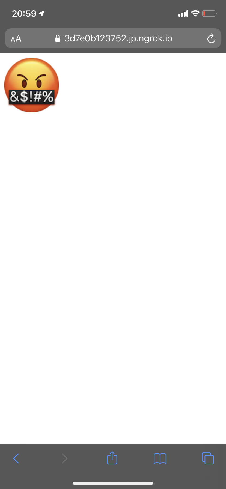

실제 아이폰에서 출력된 화면입니다. 100px의 이미지를 100px로 출력했지만 실제로 배율을 계산해 300px의 사이즈로 표시됩니다. 하지만 이미지의 해상도는 100px이기 때문에 다음과 같이 이미지에서 계단현상을 볼 수 있습니다.

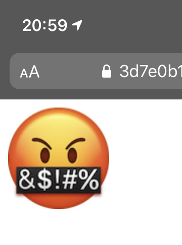

#### 2.2.1 `srcset`속성

`srcset`을 사용하면 픽셀밀도에 맞춰 최적화된 해상도의 이미지를 선별하여 출력합니다. 다음과 같이 img태그를 수정하겠습니다

```html

```

다음과 같이 이미지가 선명하게 표시됩니다.

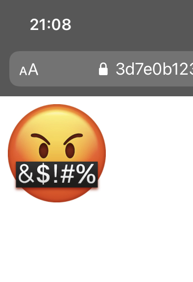

`srcset`의 내용을 정리하자면, 브라우저에서 뷰포트와 배율을 계산하여 계산된 이미지의 실제 해상도가 100px로 출력되야 할 때는 100px.png 파일을, 200px으로 출력되야 할 때는 200px.png파일을, 300px로 출력되야 할 때는 300px.png 파일을 보여주라는 의미 입니다. w 디스크립터를 사용하는 이유는, 배율을 포함하는 뷰포트 크기와 구별하기 위해서 입니다.

`width`를 직접 지정하면, w 디스크립터를 계산하여 이미지를 변환하지만 실제로 화면에 나오는 이미지 콘테이너 상자의 크기를 제한합니다. `srcset`을 확실하게 사용하기 위해서는 `sizes`속성을 함께 사용해야 좋습니다.

위의 이미지가 선명해 지는 이유는, 배율이 계산된 이미지의 실제 크기가 300px로 출력되야 하기 때문에 300w 디스크립터로 지정한 300px.png 이미지가 출력되기 때문입니다. 하지만 width값을 고정으로 하는 건 좋지 않습니다.

```html

```

이번에는 픽셀밀도를 지정할 수 있습니다. 1배율(1DPR)에서는 해상도 100px 이미지를 2배율(2DPR)에서는 해상도 200px이미지를 3배율(3DPR)에서는 해상도 300px이미지를 보여주라는 의미입니다.

참고로 이곳에 입력된 디스크립터 혹은 배율은 상한값을 지정하는 것 입니다. 즉 100w는 0\~100w를 포함하며 200w는 101w\~200w, 300w는 201w\~300w를 뜻하며 이는 배율로 지정할 때도 마찬가지 입니다.

#### 2.2.1 `sizes`속성

`sizes`를 이용하면 출력크기가 아니라 이미지 콘테이너의 크기를 뷰포트 크기에 맞춰 지정할 수 있습니다. 다음과 같은 내용을 태그에 추가하겠습니다.

```html

```

뷰포트의 크기가 0\~400px일 때는 이미지 콘테이너의 크기를 120px로, 401\~600px일 때는 220px, 601\~900px일 때는 320px, 900px\~ 는 500px로 표시하라고 지정한 것 입니다. 동시에 srcset의 효과를 받아서 픽셀밀도에도 맞춰지기 때문에 이미지가 깨질 일도 없습니다.

> width속성과 다르게 sizes의 경우 srcset에서 w 디스크립터로 계산될 이미지의 크기를 지정해 줄 수 있습니다. 때문에 단일 이미지의 크기더라도 srcset의 w 디스크립터를 사용한다면 sizes속성을 이용 해 주시는 것이 좋습니다.

예시를 들어 뷰포트의 크기를 200px로 지정하였을 때 입니다. 이미지 콘테이너의 크기는 120px으로 해당 사이즈는 200w에 걸리므로 해상도 200px의 이미지가 출력됩니다.

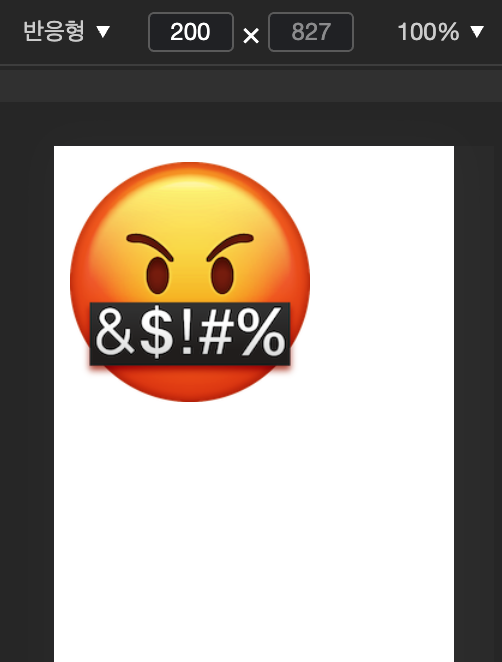

다시 뷰포트의 크기를 500px로 늘리면 이미지 콘테이너는 220px로 늘어나고 해당 사이즈는 300w에 걸리므로 해상도 300px의 이미지가 출력됩니다.

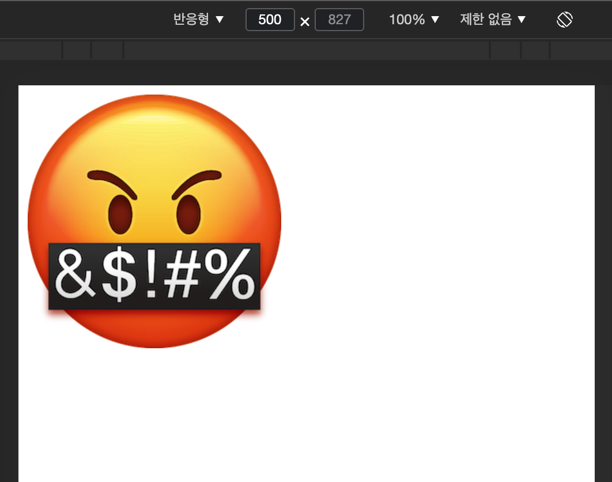

이런 방식으로 디바이스 뷰포트의 크기 맞춰 이미지의 해상도와 크기를 반응형으로 표현할 수 있습니다.

만약 태그에서 `width`와 `sizes`가 동시에 지정된 경우에는 `sizes`를 무시하고 이미지 컨테이너는 width에 맞춰 표시하니 주의하시길 바랍니다.

---

### 2.3 `<picture>`태그

`<picture>` 태그는 `<source>`태그와 함께 사용하여 ``태그의 기능을 확장해 줄 수 있습니다. 아래와 같이 사용 가능합니다.

```html
<picture>
  <source srcset="./img/100px.png 100w" media="(max-width: 100px)" />
  <source srcset="./img/200px.png 200w" media="(max-width: 200px)" />
  <source srcset="./img/300px.png 300w" media="(max-width: 300px)" />
  
</picture>
```

``태그를 `picture` 태그로 감싸면 반응형 이미지로 선언할 수 있습니다. 그리고 `source` 태그에 속성을 추가하여 다양한 속성별로 다른 이미지를 선언할 수 있습니다. 단 `source`태그를 `picture`태그 내에서 사용할 경우에는 `src`속성이 없으니 참고해야 합니다.

`picture` 태그를 사용하게 되면, 다양한 조건에서 이미지를 선별하여 출력할 수 있습니다. 내부에서 위에서부터 순차적으로 `source`태그의 속성을 확인한 뒤 출력할 수 있다면 해당 이미지를 출력합니다. 그러다가 모든 `source`태그의 기준을 벗어나게 되면 img태그에 있는 이미지를 출력합니다.

`media`속성을 이용해 뷰포트의 크기별로, `srcset` 속성을 이용해 배율별로 다른 이미지를 지정 해 줄수도 있으며 `sizes` 속성을 통해 뷰포트별 세분화가 한번 더 가능합니다.

또한 이미지의 크기나 해상도 뿐 만 아니라, `type`속성을 이용하면 다양한 종류의 이미지파일의 호환성을 지키며 사용할 수 있습니다. 다음과 같은 예를 들어보겠습니다.

```html
<picture>
  <source type="image/webp" srcset="logo.webp" />
  <source type="image/svg+xml" srcset="logo.svg" />
  
</picture>
```

`type` 속성에 MIME타입을 선언하여 해당 이미지 포맷을 출력할 수 있다면 출력하고 불가능하다면 다음으로 넘어가게 지정합니다. 브라우저에서 webp를 지원한다면 webp이미지를, webp를 지원하지 못하지면 svg를 지원한다면 svg를 둘 다 불가능하다면 png파일을 출력하게 만들어 가능하다면 더 효율적인 이미지 포맷을 사용할 수 있습니다.

이렇게 `pictrue`태그를 적절히 활용하면 다양한 환경에서 호환성까지 고려하여 이미지를 추가할 수 있습니다. ``태그의 `srcset`과 `sizes`속성도 포함하기 때문에 사실상 ``태그의 완벽한 상위호환 태그이지만, **역시나 IE11에서는 지원하지 않습니다.**

## 3. 반응형 웹디자인에서 사용하는 CSS

### 3.1 반응형 단위

반응형 웹디자인에서는 크기를 `px`값으로 고정하는 대신 상대단위를 많이 사용합니다. 그 중에서도 많이 사용되는 단위를 정리했습니다.

| 상대 단위 |            비교대상            |
| :-------: | :----------------------------: |
|    em     |     해당 요소의 폰트 크기      |
|    rem    |     루트 요소의 폰트 크기      |
|    vw     |        뷰포트 너비의 1%        |
|    vh     |        뷰포트 높이의 1%        |
|   vmin    | 뷰포트 길이 중 더 짧은 것의 1% |
|   vmax    |  뷰포트 길이 중 더 긴 것의 1%  |
|     %     |         부모 요소 기준         |

#### 3.1.1 em

em은 요소에 지정된 폰트크기(지정되지 않은 경우 상속된 크기)를 기준으로 상대적인 크기를 설정합니다. 예를 들어 1em은 요소에 지정된 크기와 같고 2em은 요소에 지정된 크기의 2배입니다. 폰트 크기나 콘텐츠를 포함하는 컨테이너의 크기 설정에 사용하면 상대적인 설정이 가능하여 편리합니다. 즉, 폰트크기에 따라 여백이 자동으로 변경되는 디자인에 적용할 수 있습니다.

#### 3.1.2 rem

rem의 r은 root를 의미하며 최상위 요소(html)의 폰트크기를 기준으로 합니다. 사용자가 브라우저의 기본 폰트 크기를 변경(Mac Chrome의 경우, 설정 > 고급 설정 표시 > 웹 콘텐츠 > 글꼴 맞춤 설정)할 경우, 해당 크기에 따라 전체적인 폰트 크기를 맞추어 제공할 수 있습니다. (`px`로 지정할 경우 사용자가 브라우저에서 폰트 사이즈 설정을 바꿔도 반응하지 못합니다.)  
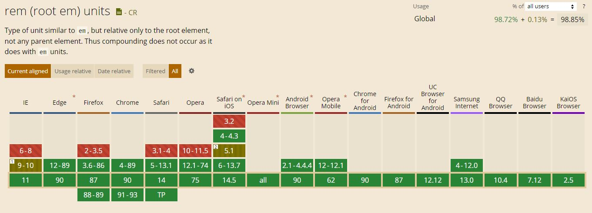

#### 3.1.3 %(백분률) 단위

콘텐츠 너비를 픽셀로 지정하면 뷰포트가 작을 경우 콘텐츠를 보기위해 수평으로 스크롤을 해야합니다. 너비를 % 단위로 지정하면 스크롤바가 생성되지 않고 콘텐츠 너비가 줄어듭니다.

#### 3.1.4 viewport 단위(vh, vw, vmin, vmax)

반응형 웹디자인은 화면 크기에 동적으로 대응하기 위해 % 단위를 자주 사용합니다. % 단위는 em과 같이 상속에 의해 부모 요소에 상대적인 영향을 받습는다. 뷰포트란 웹 페이지가 브라우저 화면상에서 실제로 표시되는 영역입니다. 따라서 뷰포트 단위를 사용하면 화면크기에 따른 상대 크기를 설정할 수 있습니다. viewport 너비가 1000px, 높이가 600px인 경우에 1vw = 10px, 1vh = 6px, 1vmin = 6px, 1vmax = 10px이 됩니다.  
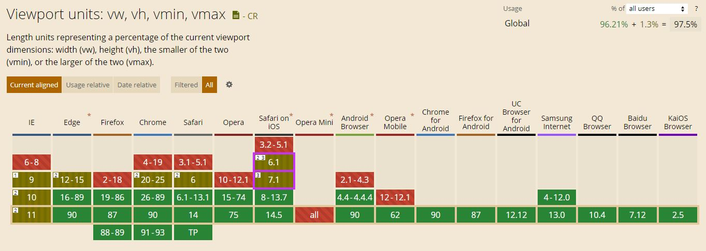

<hr />

### 3.2 가변 미디어 크기지정 (max-width)

뷰포트 크기가 변할 때 이미지, 비디오와 같은 미디어 타입을 뷰포트 변화에 맞추어 변경하기 위해 `max-width`속성을 `100%`로 지정합니다. 이미지가 해당하는 공간에 맞게 줄어들 수 있고, `width: 100%;` 와 다른 점은 최대 너비로 지정했기 때문에 이미지가 가진 너비(원본)보다 늘어나지 않습니다.

```css
img,
video {
  max-width: 100%;
}
```

<hr />

### 3.3 반응형에서 사용할 수 있는 css 함수

#### 3.3.1 calc()

`calc()`를 이용하면 CSS 속성값으로 계산식을 지정할 수 있습니다. 함수 사용시 +와 - 연산자는 좌우에 공백이 있어야 합니다. 고정된 너비의 여백을 가진 요소를 쉽게 배치할 수 있습니다.

```css
/* property: calc(expression) */
width: calc(100% - 80px);
```

아래와 같이 현수막의 너비가 화면에 꽉 차면서 좌우 여백으로 40픽셀을 가지도록 지정할 수 있습니다.

```css
.banner {
  width: calc(100% - 80px);
  border: 1px solid black;
  padding: 6px;
  text-align: center;
  box-sizing: border-box;
}
```

```html
<div class="banner">이건 현수막입니다!</div>
```

calc() 의 브라우저 호환성은 다음과 같습니다.
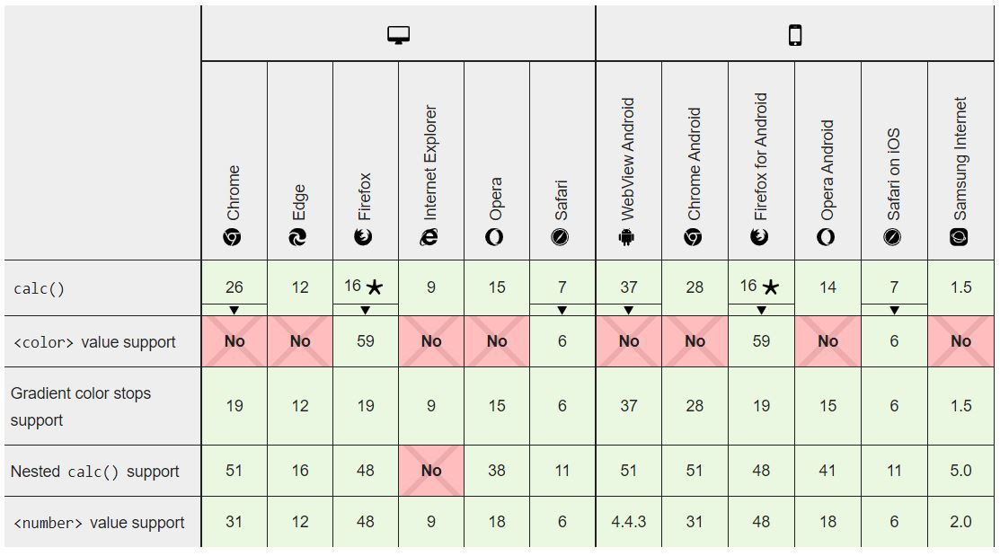

#### 3.3.2 min(), max()

CSS 속성값 지정에 min, max 함수를 사용할 수 있습니다. 길이, 빈도수, 각도, 시간, 퍼센트, 숫자, 정수를 사용하는 곳에 허용됩니다.

`width: max(20vw, 400px); ` 를지정하면 박스의 최소 너비는 400px이고 뷰포트가 2000px 보다 클 경우(20vw = 20 _ 1vw = 20 _ 20px = 400px) 20vw 계산값이 적용됩니다.

min(), max() 의 브라우저 호환성은 다음과 같습니다.
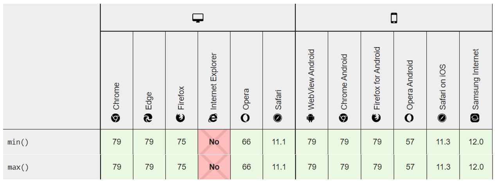

#### 3.3.3 clamp(minimum, preferred, maximum)

뷰포트의 너비가 증가함에 따라 최소 크기와 최대 크기 사이에서 선형적으로 크기를 조절할 때 CSS clamp함수를 사용할 수 있습니다. `width: clamp(300px, 50%, 800px` 일 때 반환되는 값은 50%(선호하는 값, preferred)를 계산한 값이 적용되는데 만약 계산한 값이 300px 보다 작다면 최소값 300px이, 800px보다 크다면 최대값 800px이 적용됩니다. 따라서 아래 그림처럼 항상 50%를 유지하되 300px 이하로는 줄어드지 않고 800px 이상으로는 커지지 않는 박스를 만들 때 또는 폰트 크기를 지정할 때 유용합니다.


clamp() 의 브라우저 호환성은 다음과 같습니다.


- min, max, calc, clamp 함수를 사용한 예시입니다. [화면](https://mdn.github.io/css-examples/min-max-clamp/) 에서 확인해볼 수 있습니다.

  ```css
  body {
    margin: 0 auto;
    width: min(1000px, calc(70% + 100px));
  }

  h1 {
    letter-spacing: 2px;
    font-size: clamp(1.8rem, 2.5vw, 2.8rem);
  }

  p {
    line-height: 1.5;
    font-size: max(1.2rem, 1.2vw);
  }
  ```

  ```html
  <h1>Simple responsive test</h1>
  <p>
    Lorem ipsum dolor sit amet, consectetur adipiscing elit. In orci orci, eleifend id risus nec, mattis rutrum velit.
    Suspendisse fringilla egestas ---
  </p>
  <p>Integer rutrum sollicitudin tellus, quis cursus nulla scelerisque nec. Nunc eu facilisis lorem. Maecenas ---</p>
  ```

<hr />

### 3.4 반응형 레이아웃

#### 3.4.1 flexbox 를 이용한 레이아웃

반응형 웹디자인에서 flexbox를 이용하면 flex-grow 및 flex-shrink 속성을 통해 공간이 남거나 부족할 경우에도 원하는 레이아웃을 설정할 수 있습니다.

```css
.items {
  display: flex;
  justify-content: space-between;
}
```

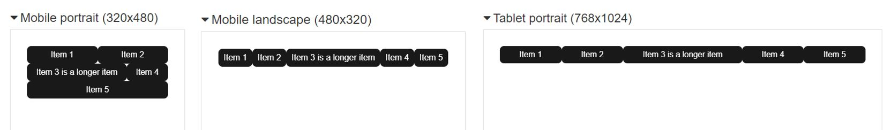

flexbox 의 브라우저 호환성은 다음과 같습니다.
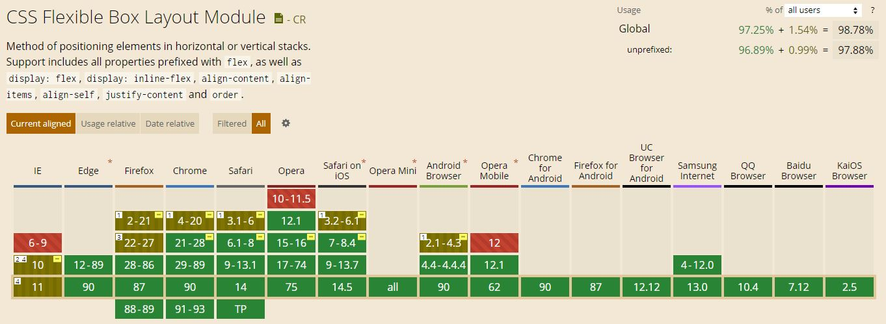

#### 3.4.2 grid 와 fr 단위를 이용한 레이아웃

반응형 웹디자인에서 grid와 `fr`단위를 이용하여 레이아웃을 구현할 수 있습니다. fr 단위는 그리드 컨테이너의 여유 공간을 비율로 나눠 설정합니다.

```css
.container {
  display: grid;
  grid-template-columns: 1fr 3fr;
}
```

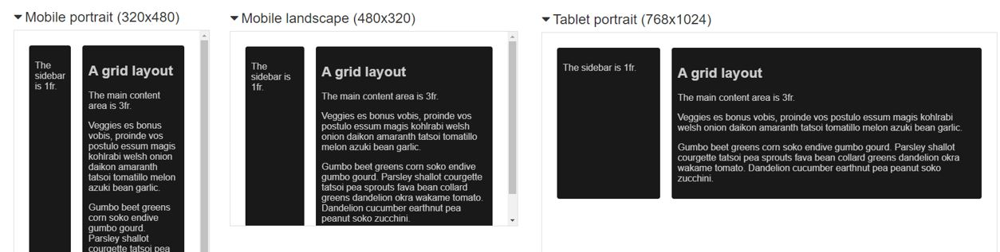

grid 의 브라우저 호환성은 다음과 같습니다.
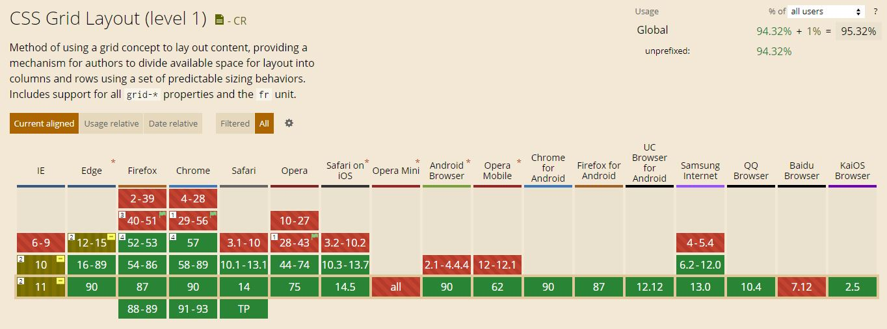

- flex와 grid를 사용한 반응형 웹디자인 예시입니다. [화면](https://mdn.github.io/css-examples/learn/media-queries/grid.html) 과 [소스코드](https://github.com/mdn/css-examples/blob/master/learn/media-queries/grid.html)를 확인할 수 있습니다.  
  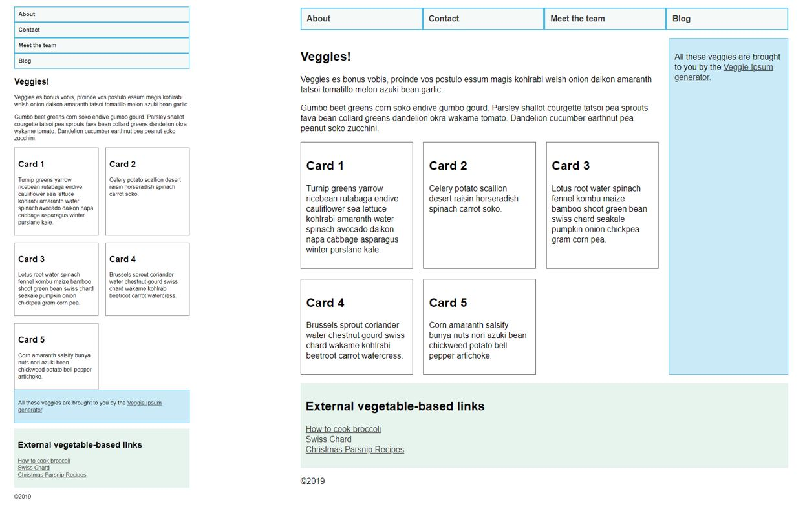

#### 3.4.3 column-width 를 이용한 다단 레이아웃

column-width 속성을 이용한 다단 레이아웃(Multiple-column layout)을 통해 반응형 웹디자인을 구현할 수 있습니다.

```css
.container {
  column-width: 200px;
  column-gap: 20px;
}
```

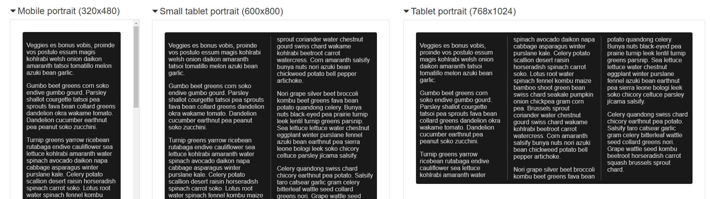

column-width 의 브라우저 호환성은 다음과 같습니다.  
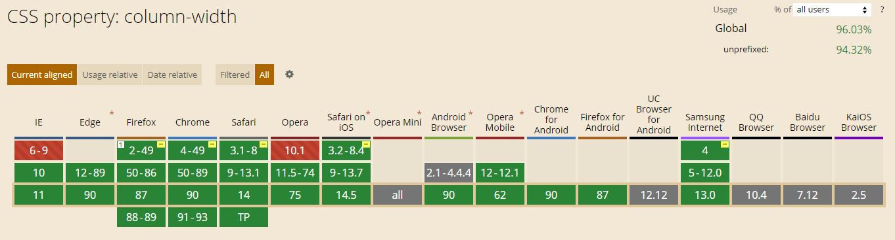

<hr />

### 3.5 CSS 미디어쿼리

미디어쿼리를 이용하면 출력 장치의 특징을 참조하여 CSS 코드를 분기 처리함으로써 하나의 HTML 소스가 여러가지 화면을 갖도록 구현할 수 있습니다.  
미디어쿼리 구문은 논리적으로 평가되며, 미디어쿼리의 타입이 기기의 타입과 일치(참)이면 뒤에 작성한 스타일이 적용되고, 거짓이면 무시됩니다.

#### 3.5.1 `@media` 규칙

```css
@media only 미디어타입 and (조건문-미디어특징) {
    실행문
}
```

|       키워드        | 내용                                                                                                                                                                                |
| :-----------------: | :---------------------------------------------------------------------------------------------------------------------------------------------------------------------------------- |
|       @media        | 미디어 쿼리가 시작됨을 선언합니다.                                                                                                                                                  |
|        only         | 미디어 쿼리를 지원하는 사용자 에이전트만 미디어 쿼리 구문을 해석하라는 명령 키워드입니다. 생략하여도 기본 값이 only로 지정되기 때문에 일반적으로 작성하지 않습니다.                 |
|     미디어타입      | 미디어 쿼리를 해석해야 할 대상 미디어를 선언합니다. 생략할 경우 기본값은 `all`이며 모든 미디어에 적용합니다. `all`,`screen`,`print`를 많이 사용합니다.                              |
|         and         | 논리적으로 `AND`연산을 수행하여 앞과 뒤의 조건을 모두 만족해야 함을 의미합니다. and 대신 콤마 `,`기호를 사용하면 `OR`연산을 수행하여 나열된 조건 중에서 하나만 참이어도 실행됩니다. |
| (조건문-미디어특징) | 브라우저는 조건문이 참일 때 {실행문}을 처리하고 거짓일 때 무시합니다. 조건문(미디어 표현식)은 괄호로 감싸야하고, 특성이름과 해당하는 값을 `:`로 연결하여 작성합니다.                |
|      {실행문}       | CSS코드를 중괄호안에 작성합니다. 브라우저는 (조건문)이 참일 때, 실행문 안의 CSS 코드를 해석하여 적용합니다.                                                                         |

#### 3.5.2 미디어쿼리 연산자

- 가장 단순한 형태의 미디어 쿼리

  ```css
  @media (min-width: 700px) {
    background-color: yellow;
  }
  ```

  위의 예시는 미디어 타입 기본값 `all`이 생략된 것으로 다음 구문과 같습니다. 모든 유형의 장치 중 최소너비가 700px일 때 스타일을 적용하겠다는 의미입니다.

  ```css
  @media all and (min-width: 700px) {
    background-color: yellow;
  }
  ```

- and 연산자

  새로운 미디어 특징들을 추가할 때마다 `and` 연산자를 사용합니다. 아래 예사는 프린트 장치이며, 최소너비가 700px 이상이고 방향이 가로일 때 스타일을 적용하겠다는 의미입니다.

  ```css
  @media print and (min-width: 700px) and (orientation: landscape) {
    ...;
  }
  ```

- 쉼표 연산자

  쉼표는 각각 개별 미디어쿼리로 인식합니다. 아래 예시는 모든 장치에서 최소 너비 700px이상일 때 적용하거나, 프린트 장치에서는 가로 방향일 때만 적용하겠다는 의미입니다.

  ```css
  @media (min-width: 700px), print and (orientation: landscape) {
    ...;
  }
  ```

- not 연산자

  `not`은 전체 미디어 쿼리를 수식합니다. 아래 예시는 모든 스크린 색상장치에서 적용하지 않거나, 프린트 색상 장치에서 적용하겠다는 의미입니다.

  ```css
  @media not screen and (color), print and (color) {
    ...;
  }
  ```

  쉼표 연산자를 사용할 경우, 미디어 구문은 개별 미디어 쿼리로 인식하므로 not은 쉼표 이후에 영향을 미치지 않습니다. 즉 위의 예시는 다음과 같이 평가됩니다. `@media (not (screen and (color))), print and (color) { ... }`

#### 3.5.3 미디어타입

- all
  모든 미디어에 해당합니다.
- screen
  컴퓨터 모니터, 태블릿, 스마트폰 등을 대상으로 하는 타입입니다. 화면을 출력하는 디스플레이가 있는 미디어들은 모두 screen에 해당합니다.
- print
  프린트 미리보기 모드 또는 PDF에 해당하는 타입입니다. 아래 예시와 같이 웹사이트를 인쇄할 경우 적용되는 스타일을 추가할 수 있습니다. 실제 인쇄를 하지 않더라도 브라우저에서 제공하는 인쇄 미리보기 기능을 이용하면 화면으로 확인이 가능합니다.

  ```css
  @media print {
    a {
      text-decoration: none;
    }
    a:after {
      display: inline;
      content: '(' attr(href) ')';
    }
  }
  ```

- speech
  페이지를 읽어주는 화면 낭독기를 대상으로 하는 타입입니다.

#### 3.5.4 미디어특징

조건문에 작성할 수 있는 주요 미디어특징입니다.

- (min/max) width / height
  뷰포트의 너비와 높이로 뷰포트의 크기는 HTML body 콘텐츠를 표시하는 영역으로 실제 스크린의 크기와는 다릅니다. 반응형 웹 구현시 가장 일반적으로 사용하는 조건입니다.
  `(width:00px)` 이라고 선언하면 뷰포트 너비가 정확히 00px 에서만 적용되기 때문에 보통 min/max 접두사를 붙이고 사용합니다.
  <br>
- (min/max) device-width / device-height (deprecated)
  스크린의 너비와 높이로 스크린은 출력 장치가 픽셀을 표시할 수 있는 모든 영역입니다.
  <br>

- orientation (portrait / landscape)

  뷰포트의 너비와 높이 비율을 이용하여 세로 모드인지 가로 모드인지를 판단합니다.

  ```css
  @media all and (orientation: portrait) {
    ...;
    // 세로 모드. 뷰포트의 높이가 너비에 비해 상대적으로 크면 실행
  }

  @media all and (orientation: landscape) {
    ...;
    // 가로 모드. 뷰포트의 너비가 높이에 비해 상대적으로 크면 실행
  }
  ```

- (min/max) aspect-ratio
  뷰포트의 너비와 높이에 대한 비율로 ‘너비/높이’ 순으로 조건을 작성합니다.

  ```css
  @media all and (aspect-ratio:5/4) { … } // 뷰포트 너비가 5, 높이가 4 비율이면 실행
  @media all and (min-aspect-ratio:5/4) { … } // 뷰포트 너비가 5/4 비율 이상이면 실행
  @media all and (max-aspect-ratio:5/4) { … } // 뷰포트 너비가 5/4 비율 이하면 실행

  ```

- (min/max) device-aspect-ratio

  스크린의 너비와 높이에 대한 비율로 ‘너비/높이’ 순으로 조건을 작성합니다.

  ```css
  @media all and (device-aspect-ratio:5/4) { … } // 스크린 너비가 5, 높이가 4 비율이면 실행
  @media all and (min-device-aspect-ratio:5/4) { … } // 스크린 너비가 5/4 비율 이상이면 실행
  @media all and (max-device-aspect-ratio:5/4) { … } // 스크린 너비가 5/4 비율 이하면 실행
  ```

- (min/max) color
  출력 장치의 색상에 대한 비트 수로 출력 장치가 컬러가 아닌 경우 0에 대응합니다.

  ```css
  @media all and (color) { … } // 출력 장치가 컬러를 지원하면 실행
  @media all and (color:0) { … } // 출력 장치가 컬러가 아니면 실행
  @media all and (color:8) { … } // 출력 장치가 8비트 색상이면 실행
  @media all and (min-color:8) { … } // 출력 장치가 8비트 이상 색상이면 실행
  @media all and (max-color:8) { … } // 출력 장치가 8비트 이하 색상이면 실행
  ```

각 미디어특징의 브라우저 호환성은 다음과 같습니다.  
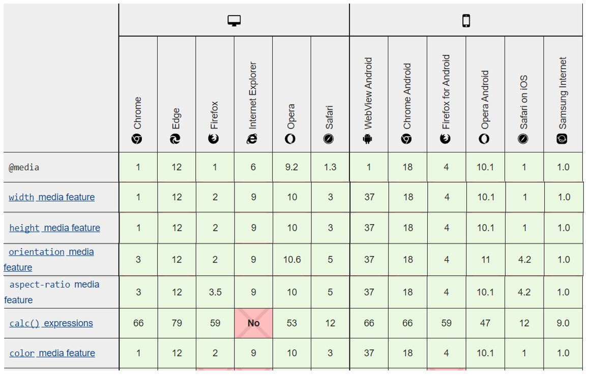

#### 3.5.5 분기점(breakpoints) 설정하기

모든 해상도를 위한 웹페이지를 개발할 경우 아래와 같이 분기점을 나누어 미디어쿼리를 적용할 수 있습니다.

```css
/* All Device */
모든 해상도를 위한 공통 코드를 작성합니다. 모든 해상도에서 이 코드가 실행됩니다.

/* Mobile Device */
768px 미만 해상도의 모바일 기기를 위한 코드를 작성합니다. 모든 해상도에서 이 코드가 실행됩니다. 미디어 쿼리를 지원하지 않는 모바일 기기를 위해 미디어 쿼리 구문을 사용하지 않습니다.

/* Tablet & Desktop Device */
@media all and (min-width:768px) {
    사용자 해상도가 768px 이상일 때 이 코드가 실행됩니다. 테블릿과 데스크톱의 공통 코드를 작성합니다.
}

/* Tablet Device */
@media all and (min-width:768px) and (max-width:1024px) {
    사용자 해상도가 768px 이상이고 1024px 이하일 때 이 코드가 실행됩니다. 아이패드 또는 비교적 작은 해상도의 랩탑이나 데스크톱에 대응하는 코드를 작성합니다.
}

/* Desktop Device */
@media all and (min-width:1025px) {
    사용자 해상도가 1025px 이상일 때 이 코드가 실행됩니다. 1025px 이상의 랩탑 또는 데스크톱에 대응하는 코드를 작성합니다.
}
```

##### 1) 데스크탑 중심(desktop first)

스마트폰이 활성화되기 전에는 대부분의 웹페이지가 데스크탑 모니터 사이즈를 중심으로 제작되었습니다. PC로 볼 경우의 스타일을 먼저 지정해 준 후, 모바일 스타일을 덮어쓰기 형태로 지정해 주는 방식입니다.

```css
/* desktop first */
@media screen and (max-width: 1200px) {
  ...;
}
@media screen and (max-width: 768px) {
  ...;
}
@media screen and (max-width: 480px) {
  ...;
}
```

##### 2) 모바일 중심(mobile first)

모바일의 스타일을 먼저 지정해 준 후, PC 스타일을 지정해 주는 방식입니다.  
작은 화면(예: 휴대폰)에 대한 간단한 레이아웃을 만든 다음, 화면이 점점 커졌을 때 화면 폭이 충분하다면 다음 분기점을 설정하고 다단 레이아웃을 구현하는 방식입니다. 이렇게 하면 내용에 따라 분기점을 최적화하고 가능한 최소 분기점 수를 유지할 수 있습니다.

```css
/* mobile first */
@media screen and (max-width: 480px) {
  ...;
}
@media screen and (max-width: 768px) {
  ...;
}
@media screen and (max-width: 1200px) {
  ...;
}
```

## 참고 자료

- [MDN 반응형 디자인](https://developer.mozilla.org/ko/docs/Learn/CSS/CSS_layout/Responsive_Design)
- [Google Developers](https://developers.google.com/web/fundamentals/design-and-ux/responsive/patterns?hl=ko)
- [비즈플로우](http://beesflow.co.kr/%eb%b0%98%ec%9d%91%ed%98%95%ec%9b%b9%ec%9d%b4%eb%9e%80/)
- [나무위키](https://namu.wiki/w/%EB%B0%98%EC%9D%91%ED%98%95%20%EC%9B%B9?from=%EB%B0%98%EC%9D%91%ED%98%95%20%EC%9B%B9%20%EB%94%94%EC%9E%90%EC%9D%B8)
- [yamoo9님 자료1](https://github.com/yamoo9/cj-olive-networks/wiki)
- [yamoo9님 자료2](https://github.com/yamoo9/cj-olive-networks/wiki/%EC%A0%81%EC%9D%91%ED%98%95-%EC%9B%B9-%EB%94%94%EC%9E%90%EC%9D%B8-VS-%EB%B0%98%EC%9D%91%ED%98%95-%EC%9B%B9-%EB%94%94%EC%9E%90%EC%9D%B8)
- [Darum](https://daumui.tistory.com/41?category=481955)
- [fjcalzado의 깃허브 예제](https://fjcalzado.github.io/DemoSeries-Responsive-Layout-Patterns/pages/layout-shifter.html)
- [MDN-CSS values and units](https://developer.mozilla.org/en-US/docs/Web/CSS/CSS_Values_and_Units)
- [MDN-Using media queries](https://developer.mozilla.org/en-US/docs/Web/CSS/Media_Queries/Using_media_queries)
- [MDN-Beginner's guide to media queries](https://developer.mozilla.org/en-US/docs/Learn/CSS/CSS_layout/Media_queries)
- [MDN-Multiple-column layout](https://developer.mozilla.org/en-US/docs/Learn/CSS/CSS_layout/Multiple-column_Layout)
- [MDN-calc()](<https://developer.mozilla.org/ko/docs/Web/CSS/calc()>)
- [MDN-clamp()](<https://developer.mozilla.org/en-US/docs/Web/CSS/clamp()>)
- [w3-Flexible Lengths: the fr unit](https://www.w3.org/TR/css-grid-1/#fr-unit)
- [반응형 웹 뚝딱 만들기 (1) - 뷰포트 메타태그와 미디어 쿼리](https://nykim.work/84)
- [Understanding the Device Pixel Ratio](https://tomroth.com.au/dpr/)
- [MDN - 표준 메타데이터 이름](https://developer.mozilla.org/ko/docs/Web/HTML/Element/meta/name)
- [HTML IMG의 srcset과 sizes 속성(updated)](https://heropy.blog/2019/06/16/html-img-srcset-and-sizes/)
- [TCPSchool - HTML \<picture\> 태그](http://www.tcpschool.com/html-tags/picture)
- [MDN - 반응형 이미지](https://developer.mozilla.org/ko/docs/Learn/HTML/Multimedia_and_embedding/Responsive_images)
- [MDN - \<picture\>: The Picture element
  ](https://developer.mozilla.org/en-US/docs/Web/HTML/Element/picture)
- [MDN - \<source\>: The Media or Image Source element](https://developer.mozilla.org/en-US/docs/Web/HTML/Element/source)
