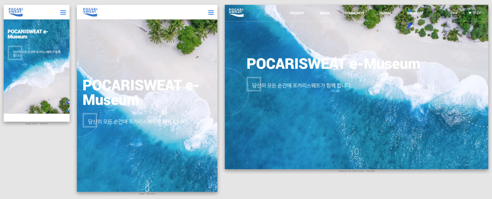
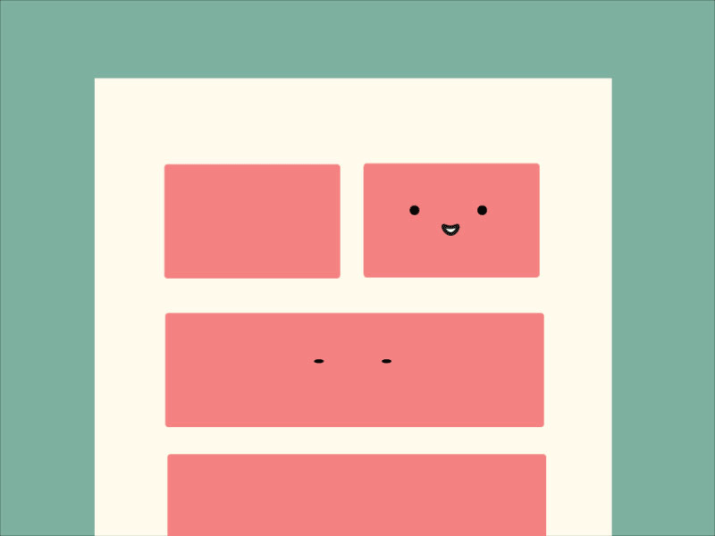
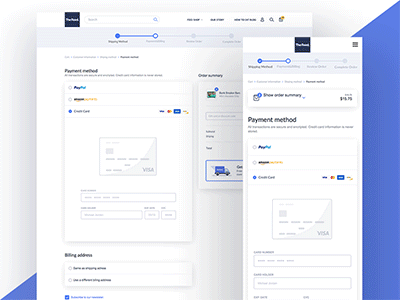
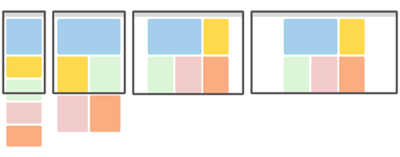
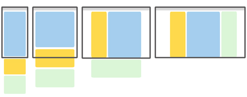
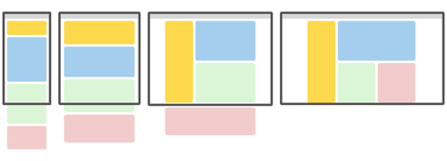
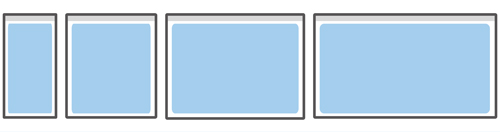
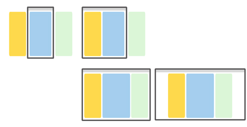

# 반응형 웹 디자인

## 1. 반응형 웹 디자인이란?
- 반응형 웹 디자인이라는 용어는 2010년 **이단 마르코트**에 의해 이야기되기 시작했습니다. 
- 다양한 디바이스에 따라 화면의 크기가 최적화되도록 자동으로 조절되는 웹페이지를 의미합니다.
    - 하나의 웹페이지 소스(HTML), 하나의 주소(URL), 하나의 컨텐츠로 최적화된 웹페이지를 제공하는 것을 목적으로 합니다.



### 1.1 탄생 배경
초창기에 웹 페이지를 구축할 때는 매우 구체적인 화면 크기를 공략 대상으로 삼았습니다. 그래서 예상한 크기에서 벗어난 화면의 기기를 가지고 있다면 원하지 않는 스크롤 막대에서부터 지나치게 긴 길이의 라인, 사용 공간이 부족하게 되는 결과를 낳았습니다. 이와 같은 문제를 해결하기 위해 반응형 웹 디자인 개념이 등장했습니다.

### 1.2 핵심 원리

#### 1.2.1 유연한 그리드 (Fluid Grid)
- 유연한 그리드는 사용자 기기의 화면 크기에 따라 최적화(변경) 됩니다. 
- 픽셀(`px`)이 아닌, 퍼센트(`%`) 또는 `em`, 'rem' 같은 상대 측정 단위가 사용됩니다.



#### 1.2.2 유연한 이미지 (Flexible Images)
- 이미지의 크기가 다양한 디바이스의 화면 크기에 따라 자동으로 확대/축소되는 것을 말합니다.
  - 일반적으로 브라우저상의 이미지는 고정된 크기를 가집니다,
  - 반양형 웹 디자인에서는 이미지가 브라우저의 창 크기에 맞게 적절한 형태로 변경될 수 있도록, 창의 가로너비에 유동적으로 변하는 단위를 사용합니다,.
  - 기술적으로는 아래와 같은 CSS 코드를 추가해주면 가변성을 갖게 됩니다.
  ```css
  max-width: 100%;
  ```


#### 1.2.3 미디어 쿼리 (Media Query)
- CSS2부터 시작되어 CSS3에서 본격적으로 쓰이기 시작한 웹 기법입니다.
- CSS3 Media Queries를 사용하면 반응형 디자인을 보다 구체적으로 세분화하고 특정 화면 크기에 따라 적절하게 조정할 수 있습니다.
- 미디어 쿼리를 사용하면 화면 크기를 결정하고 CSS 스타일을 반영합니다.
- 미디어 쿼리의 코드는 아래와 같습니다.
```css
@media 미디어 타입 (너비 및 높이) {
    (CSS 입력)
}
```



<hr />

### 1.3 장점

#### 1.3.1 간편한 유지보수
- 모바일 버전과 데스크톱 버전같이 두 개의 웹사이트를 만들 경우
  - 새로운 내용이 추가되거나 수정이 필요할 때 개별적으로 추가 및 수정이 필요합니다.
  - 개별 작업을 해야하므로 공수가 많이 들어갑니다.
- 반응형 웹으로 작업할 경우 사용자 디바이스와 상관없이 모든 디자인을 하나의 HTML 파일과 CSS 파일에서 작업하기 때문에 유지보수가 훤씬 쉽고 간편합니다.

#### 1.3.2 유연한 마케팅 
- 쉽게 접근할 수 있는 점과 다양한 활동을 자유롭게 펼칠 수 있기 때문에 마케팅 활동의 주요 수단으로 사용됩니다.
  - 데스크톱 버전만 만들게되면 작은 화면의 스마트 기기선 정보들이 제대로 전달되지 않을 수 있습니다.
- 반응형 기술을 이용하여 웹사이트를 개발하면 다양한 기기에 따라 최적화된 구조로 웹사이트를 보여줄 수 있습니다.
  - 언제, 어디서, 어떻게든 접근이 용이하기 때문에 마케팅이 유리합니다.

#### 1.3.3 최적화된 검색 엔진
- 모바일 버전과 데스크탑 버전 두 개의 사이트를 가지고 있는 경우, 검색엔진에서는 어떠한 주소의 정보가 정확한 정보인지 확인하기 힘들어 검색 결과에서 제외하거나 검색 결과 상위권에 배치하는 것이 상대적으로 불리해집니다.
  - 상위권에 노출시키고자 광고를 하게된다면 광고 비용 또한 두개의 웹사이트이기 때문에 두 배로 들것입니다.
- **반응형 웹페이지의 경우**, 하나의 주소로 검색 결과에 좀 더 노출이 잘될 수 있습니다.


#### 1.3.4 미래 지향적 기술
- 휘어지는 화면을 탑재한 스마트 기기, TV, 냉장고 등 상상만 했던 기기들이 출시되고 있고 앞으로 어떤 크기의 기기가 나올지 모르는 사황에서 반응형 웹은 미래 지향적이고, 미래를 준비하는 바람직한 대안이라고 할 수 있습니다.

<hr />

### 1.4 단점

#### 1.4.1 길어진 페이지 로딩 시간
- 반응형 페이지를 잘못 제작하게 되면 PC에 있는 1200px 사이즈의 이미지를 사용할 때 그 이미지 그대로 모바일에서 사용이 된다.

<hr />

### 1.5 반응형 웹 디자인 패턴

#### 1.5.1 유동형 (Mostly Fluid)
- 가변형 그리드로 구성하여 단순히 컨텐츠의 폭을 맞추는 방법입니다.
  - 큰 화면에서 중간 크기의 화면까지는 여백 정도만 조정됩니다.
  - 중간 크기에서 작은 화면이 되면 그리드가 움직이면서 컨텐츠를 수직으로 재배치합니다.
- 해당 패턴을 사용하는 사이트는 다음과 같습니다.
  - [A List Apart](https://mediaqueri.es/ala/)



#### 1.5.2 열 끌어놓기 (Column Drop)
- 화면폭이 좁아져서 더이상 컨텐츠의 정상적인 표시가 힘들 경우에 컨텐츠 영역의 확보를 위해 컬럼을 하단으로 떨궈서 열을 수직으로 쌓습니다.
- 화면 크기에 관계없이 사용하는 페이지를 작성하는데 도움이 됩니다.
- 해당 패턴을 사용하는 사이트는 다음과 같습니다.
  - [Modernizr](https://modernizr.com/)



#### 1.5.3 배치 이동 (Layout Shifter)
- 반응성이 가장 뛰어난 패턴입니다.
- 스크린이 크기마다 다른 형태의 레이아웃을 사용합니다.
- 컬럼을 이동 및 재배치하는 방식이 아닌, 기기나 화면 사이즈에 따라 콘텐츠를 이동시켜 레이아웃을 변형합니다.
- 다른 패턴에 비해 단조로움을 벗어날 수 있습니다.
  - 단, 서버의 작업이 상대적으로 많이 필요하고 유지보수가 복잡합니다.
- 해당 패턴을 사용하는 사이트는 다음과 같습니다.
  - [Example of Layout Shifter](https://fjcalzado.github.io/DemoSeries-Responsive-Layout-Patterns/pages/layout-shifter.html)



#### 1.5.4 미세 조정 (Tiny Tweaks)
- 글꼴이나 이미지의 크기 조정 또는 콘텐츠 미세 이동 등과 같은 작은 변화만 이루어집니다.
- 보통 하나의 컬럼을 사용하며 브라우저의 폭이 변하더라도 레이아웃이 크게 변하지 않습니다.
  - 보통 블로그에서 많이 사용됩니다.
- 해당 패턴을 사용하는 사이트는 다음과 같습니다.
  - [Ginger Whale](http://gingerwhale.com/)




#### 1.5.5 오프 캔버스 (off-Canvas)
- 메뉴나 서브 컬럼을 화면 좌/우측에 숨셔두고 필요할때 노출하는 패턴입니다.
  - 콘텐츠를 수직으로 쌓지 않고 사용 빈도가 낮은 콘텐츠를 화면 밖에 배치합니다.
  - 화면 크기가 커지면 표시하고, 작은 화면에서는 클릭했을 경우에만 보여줍니다.
- 해당 패턴을 사용하는 사이트는 다음과 같습니다.
  - [HTML5Rocks 문서](https://www.html5rocks.com/ko/tutorials/developertools/async-call-stack/)
  



<hr />

### 1.6 반응형 웹과 적응형 웹의 차이
- 반응형 웹은 하나의 템플릿을 사용해 모든 기기에 대응합니다.
- 적응형 웹은 선별된 기기 유형에 따라 별도의 독립적인 템플릿이 요구됩니다.
  - NAVER, DAUM 같은 포털 사이트의 경우 모바일 환경에 대응하기 위해 별도의 URL을 서비스합니다.
- 반응형 웹과 적응형 웹의 비교

|&nbsp;                 | 반응형 웹                        | 적응형 웹               |
|-----------------------|:---------------------------------|:------------------------|
| 기기 감지             | 서버 또는 브라우저에서 기기 감지 | 미디어쿼리로 기기 감지  |
| 콘텐츠 최적화         | 필요 콘텐츠만 다운로드           | 모든 콘텐츠 다운로드    |
| 기기 특성별 처리 방법 | 기기 마다 다른 템플릿            | 하나의 템플릿           |
| 로드 속도             | 빠름 (필요한 리소스만 다운)      | 느림 (모든 리소스 다운) |
| 개발/배포             | 기존 사이트 변경없이 개발 가능<br /> 그러나 추가 비용 발생 | 기존 사이트를 전면 리뉴얼하여 개발


## 참고 자료
[MDN 반응형 디자인](https://developer.mozilla.org/ko/docs/Learn/CSS/CSS_layout/Responsive_Design)
[Google Developers](https://developers.google.com/web/fundamentals/design-and-ux/responsive/patterns?hl=ko)
[비즈플로우](http://beesflow.co.kr/%eb%b0%98%ec%9d%91%ed%98%95%ec%9b%b9%ec%9d%b4%eb%9e%80/)
[나무위키](https://namu.wiki/w/%EB%B0%98%EC%9D%91%ED%98%95%20%EC%9B%B9?from=%EB%B0%98%EC%9D%91%ED%98%95%20%EC%9B%B9%20%EB%94%94%EC%9E%90%EC%9D%B8)
[yamoo9님 자료1](https://github.com/yamoo9/cj-olive-networks/wiki)
[yamoo9님 자료2](https://github.com/yamoo9/cj-olive-networks/wiki/%EC%A0%81%EC%9D%91%ED%98%95-%EC%9B%B9-%EB%94%94%EC%9E%90%EC%9D%B8-VS-%EB%B0%98%EC%9D%91%ED%98%95-%EC%9B%B9-%EB%94%94%EC%9E%90%EC%9D%B8)
[Darum](https://daumui.tistory.com/41?category=481955)
[fjcalzado의 깃허브 예제](https://fjcalzado.github.io/DemoSeries-Responsive-Layout-Patterns/pages/layout-shifter.html)